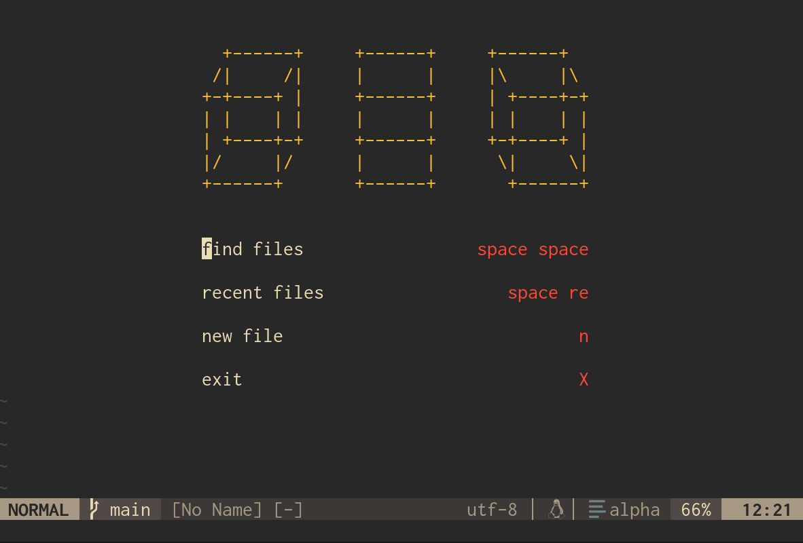

## Running/Installing

To try out the configuration, make sure you have Nix installed and the `nix-command` and `flakes` experimental features enabled. Then run:
`nix run github:clemjvdm/nixvim-config`

## Modifying the Configuration

To modify the configuration clone the repository and start editing. Then run the edited configuration from the directory containing `flake.nix` with:
`nix run .`

Looking at configuration options can be done on the [NixVim options search](https://nix-community.github.io/nixvim/search/).

### Adding Support for a Language

To add support for a language make sure to enable it in `lsp.nix`, `treesitter.nix` and optionally add it in `autocommands.nix` to set the proper indentation width automatically.

To find if your language's language server exists in the NixVim LSP servers list, you can look it up [here](https://nix-community.github.io/nixvim/search/?query=plugins.lsp.servers). You can also find treesitter supported languages [here](https://github.com/nvim-treesitter/nvim-treesitter?tab=readme-ov-file#supported-languages).

## TODO

- [ ] alpha.nvim remove selection caret
- [ ] make toggleterm look better
- [ ] fix emojis breaking when using nixd
- [ ] nixd pkgs setup
- [x] indent per filetype
- [x] alpha-nvim
- [x] nvim-cmp
- [x] LSP support
- [x] Add code snippet autocompletion
- [ ] mini.ai plugin
- [x] alpha.nvim browse option
- [ ] live update colorscheme

